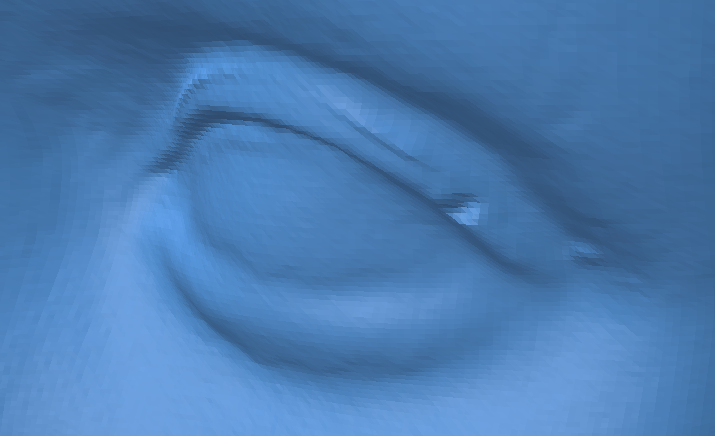
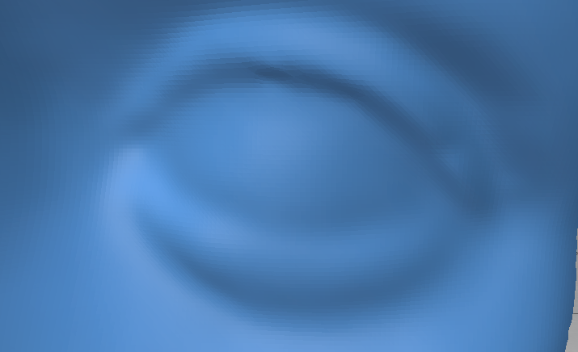
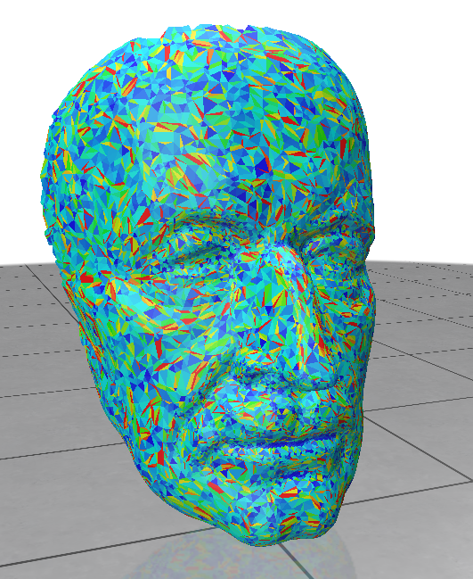
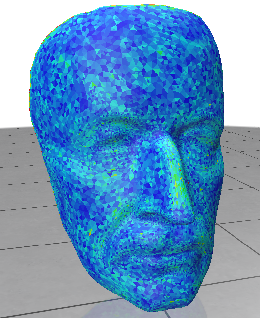
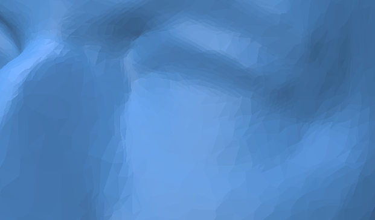
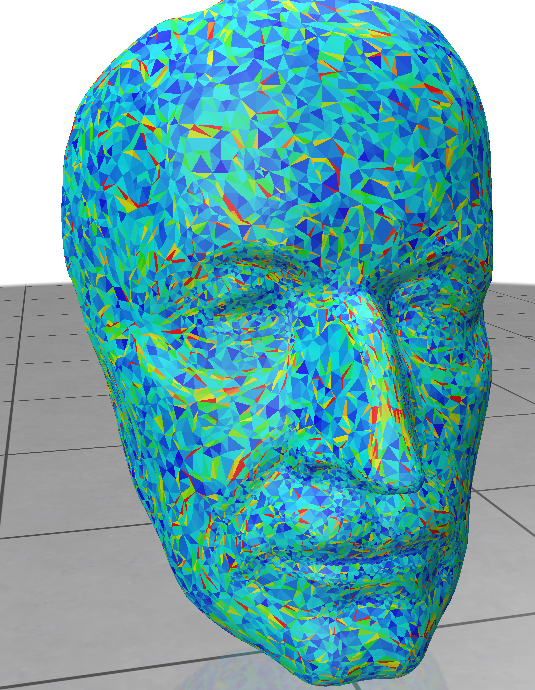
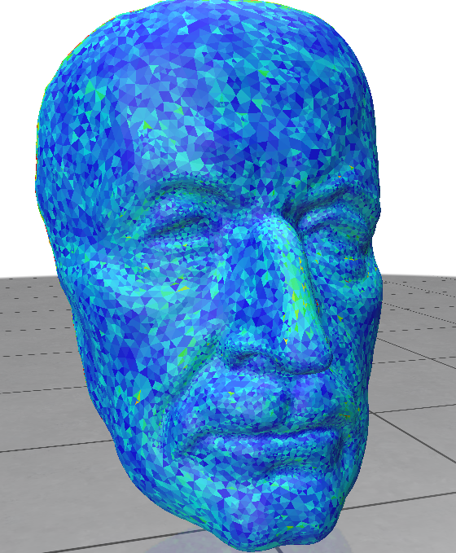

# Computer-Graphics-II-Geometric-Modeling-Exercise-2

=======

# Exercise 2 – Surface Quality and Smoothing

**Course:** Computer Graphics II – Geometric Modeling  
**Handout Date:** November 6, 2024  
**Submission Deadline:** November 19, 2024  

This README describes the implementation of various functions for surface quality and smoothing as required by the exercise. Below is a detailed explanation of the methods implemented, equations used, and challenges encountered.

---

## **Table of Contents**

1. [Uniform Laplace Operator and Smoothing](#1-uniform-laplace-operator-and-smoothing)
2. [Triangle Quality](#2-triangle-quality)
3. [Laplace-Beltrami Operator and Smoothing](#3-laplace-beltrami-operator-and-smoothing)
4. [Gaussian Curvature Approximation](#4-gaussian-curvature-approximation)

---

## **1. Uniform Laplace Operator and Smoothing**

### **1.1 Uniform Laplace Operator**

The uniform Laplacian $\( L_u(v) \)$ is computed using the centroid of the one-ring neighborhood of a vertex $\( v \)$. Mathematically:

$$
L_u(v) = \frac{1}{n} \sum_{i=1}^n v_i - v
$$

Where $\( n \)$ is the number of neighbors, $\( v_i \)$ are the neighboring vertices, and $\( v \)$ is the current vertex. This was implemented in the `computeUniformLaplaceOperator()` function. The values are stored in `self.uniformLaplaceVector`.


```python
def computeUniformLaplaceOperator(self):
    print("computing uniform Laplace operator...")

    # Iterate over all the vertices in the mesh
    for vi, vh in enumerate(self.vertexRingVertexIndices):
        # Initialize the sum of neighbors' positions as a zero vector
        sum_neighbors = np.zeros_like(self.points[vi])

        # Calculate the sum of positions of neighbors
        for neighbor_idx in vh:  
            neighbor_position = self.points[neighbor_idx]  # Use points array to get vertex position
            sum_neighbors += neighbor_position

        # Calculate the average position of the neighbors
        average_position = sum_neighbors / len(vh)

        # Get the current position of the vertex
        current_position = self.points[vi]

        # Calculate the Laplacian vector: L(v_i) = average_position - current_position
        Laplace_vector = average_position - current_position

        # Store the Laplacian vector for the current vertex
        self.uniformLaplaceVector[vi] = Laplace_vector

    print("...done")
```


#### Challenges
- Ensuring numerical stability for boundary vertices. For these, the neighborhood was redefined to exclude any external vertices.

---

### **1.2 Uniform Mean Curvature**

The mean curvature approximation is calculated as:

$$
H_u(v) = -\frac{1}{2} \|L_u(v)\|
$$

Implemented in `computeUniformMeanCurvature()`, the computed curvature values are stored in `self.uniformMeanCurvature`.


```python
def computeUniformMeanCurvature(self):
    print("compute uniform mean curvature...")

    # Compute the uniform Laplace operator first
    self.computeUniformLaplaceOperator()

    # Iterate over all vertices to calculate mean curvature
    for i in range(self.mesh.n_vertices()):
        self.uniformMeanCurvature[i] = (-1 / 2) * np.linalg.norm(self.uniformLaplaceVector[i])

    print("...done")
```


#### Challenges
- Testing was performed using different meshes to validate the correctness of the curvature.

---

### **1.3 Uniform Laplace Smoothing**

Vertices are smoothed by moving them halfway along their uniform Laplacian vector:

$$
v' = v + \frac{1}{2} L_u(v)
$$

This was implemented in `uniformLaplaceSmoothing(nbIter)`. The process iteratively updates the vertices over `nbIter` steps.

```python
def uniformLaplaceSmoothing(self, nbIter):
    for i in range(nbIter):
        print("compute one uniform smoothing step...")
        
        # Compute the uniform Laplace operator
        self.computeUniformLaplaceOperator()
        
        # Update the vertex positions
        for vi in range(self.mesh.n_vertices()):
            self.points[vi] += 0.5 * self.uniformLaplaceVector[vi]

        print("...done")
```

#### Before Smoothing


#### After 16 Iterations of Smoothing


---

## **2. Triangle Quality**

### **2.1 Definition**

The triangle quality is measured as the ratio of the circumradius $\( r \)$ to the minimum edge length $\( e_{\text{min}} \)$:

$$
\text{Quality} = \frac{r}{e_{\text{min}}}
$$

Where the circumradius is derived from:

$$
A = \frac{\|a \times b\|}{2}, \quad r = \frac{\|a\| \|b\| \|c\|}{2\|a \times b\|}
$$

Implemented in `computeTriangleQuality()`, results are stored in `self.triangleQuality`.

```python
def computeTriangleQuality(self):
    print("Computing triangle quality...")

    # Iterate over all triangles in the mesh
    for fi, f in enumerate(self.mesh.faces()):
        # Get the vertices of the triangle
        v0, v1, v2 = [vh.idx() for vh in self.mesh.fv(f)]

        # Compute vectors a, b, c
        a = self.points[v1] - self.points[v0]
        b = self.points[v2] - self.points[v0]
        c = self.points[v2] - self.points[v1]

        a_norm = np.linalg.norm(a)
        b_norm = np.linalg.norm(b)
        c_norm = np.linalg.norm(c)

        # Compute the product of the magnitudes |a| * |b| * |c|
        product_of_magnitudes = a_norm * b_norm * c_norm
        # Compute the area using the cross product of a and b
        cross_product = np.cross(a, b)

        if np.linalg.norm(cross_product) == 0:
            circumradius = 0
        else:
            circumradius = product_of_magnitudes / (2 * np.linalg.norm(cross_product))

        min_edge_length = min(a_norm, b_norm, c_norm)
        if min_edge_length == 0:
            self.triangleQuality[fi] = 0
            continue
        else:
            self.triangleQuality[fi] = circumradius / min_edge_length

    print("...done")

```
#### Challenges
- Numerical instability for degenerate triangles. A fallback was implemented to assign a high-quality value when $\( A \approx 0 \)$.

  #### Before Smoothing


#### After 16 Iterations of Smoothing



---

## **3. Laplace-Beltrami Operator and Smoothing**

### **3.1 Laplace-Beltrami Operator**

The Laplace-Beltrami operator $\( L_B(v) \)$ uses cotangent weights for neighboring vertices:

$$
L_B(v) = \sum_i w_i (v_i - v)
$$

This was implemented in `computeLaplaceBeltramiOperator()`. Results are stored in `self.LaplaceBeltramiVector`.

```python
def computeLaplaceBeltramiOperator(self):
    print("computing Laplace Beltrami operator...")

    # Iterate over all vertices in the mesh
    for vi in range(self.mesh.n_vertices()):
        acc = np.zeros(3)  # Accumulator for the Laplace-Beltrami vector
        
        # Iterate over edges connected to the vertex
        for e in self.vertexRingEdgeIndices[vi]:
            v0, v1, v2, v3 = self.coTangentEdgeVertexIndices[e]
            
            if vi == v0:
                acc += self.coTangentWeight[e] * (self.points[v1] - self.points[vi])
            elif vi == v1:
                acc += self.coTangentWeight[e] * (self.points[v0] - self.points[vi])
        
        # Store the computed Laplace-Beltrami vector
        self.LaplaceBeltramiVector[vi] = acc

    print("...done")
```

---

### **3.2 Mean Curvature**

The mean curvature is approximated as:

$$
H_B(v) = \frac{1}{2} \|L_B(v)\|
$$

Implemented in `computeLaplaceBeltramiMeanCurvature()`, with values stored in `self.LaplaceBeltramiMeanCurvature`.

```python
def computeLaplaceBeltramiMeanCurvature(self):
    print("computing Laplace-Beltrami mean curvature...")

    # Step 1: Compute the Laplace-Beltrami vectors
    self.computeLaplaceBeltramiOperator()

    # Step 2: Compute the mean curvature for each vertex
    for vi in range(self.mesh.n_vertices()):
        laplace_magnitude = np.linalg.norm(self.LaplaceBeltramiVector[vi])
        self.LaplaceBeltramiMeanCurvature[vi] = 0.5 * laplace_magnitude

    print("...done")

```
---

### **3.3 Laplace-Beltrami Smoothing**

Smoothing is achieved by normalizing the weights and updating vertices as:

$$
v' = v + \frac{1}{2} \frac{L_B(v)}{\sum w_{ij}}
$$

This was implemented in `LaplaceBeltramiSmoothing(nbIter)`.

```python
def LaplaceBeltramiSmoothing(self, nbIter):
    for i in range(nbIter):
        print(f"Computing one Laplace-Beltrami smoothing step... Iteration {i + 1}/{nbIter}")

        # Compute the Laplace-Beltrami operator and cotangent weights
        self.computeLaplaceBeltramiOperator()
        self.computeCoTangentWeights()

        # Perform smoothing for each vertex
        for vi in range(self.mesh.n_vertices()):
            weight_sum = 0.0
            new_lb = np.zeros(3)
            
            # Compute the weight sum
            for e in self.vertexRingEdgeIndices[vi]:
                weight_sum += self.coTangentWeight[e]
            
            # Compute the normalized Laplace-Beltrami vector
            new_lb = (1 / weight_sum) * self.LaplaceBeltramiVector[vi]
            
            # Update the vertex position with the smoothing factor
            self.points[vi] += 0.5 * new_lb

        print("...done")
```

#### After 16 Iterations of Laplace-Beltrami Smoothing




### **Laplace-Beltrami and Uniform Laplace Smoothing comparaison :**

- **Uniform Laplace Smoothing**:
  - While this method provides initial smoothing to reduce noise, it often **distorts the triangles**, especially in regions with high curvature or irregular geometry.
  - The resulting triangle shapes tend to become skinny or elongated, lowering their overall quality.

- **Laplace-Beltrami Smoothing**:
  - This method preserves the shape of the triangles much better, as it **minimizes distortion** by moving vertices primarily along the surface normal.
  - The triangles become more uniform and equilateral, resulting in a higher-quality mesh.

### **Final Comparison**:
- **Uniform Laplace Smoothing** is faster to compute but significantly distorts the triangles, making it less suitable for applications requiring high geometric fidelity.
- **Laplace-Beltrami Smoothing** is computationally more expensive but results in smoother surfaces with **undistorted triangle shapes**, making it ideal for high-quality mesh processing.

For applications where triangle shape preservation is critical, **Laplace-Beltrami Smoothing** is the recommended approach. For less sensitive tasks or quick noise reduction, **Uniform Laplace Smoothing** can be used.
---

### **3.4 Tangential Smoothing**

Vertices are smoothed only in the tangent plane:

$$
L_T(v) = L_u(v) - \langle L_u(v), n \rangle n
$$

Implemented in `tangentialSmoothing(nbIter)`.

```python
def tangentialSmoothing(self, nbIter):
    for i in range(nbIter):
        print(f"Compute one tangential smoothing step... Iteration {i + 1}/{nbIter}")
        
        # Step 1: Compute uniform Laplace operator
        self.computeUniformLaplaceOperator()

        # Step 2: Perform tangential smoothing
        for vi in range(self.mesh.n_vertices()):
            # Get the uniform Laplace vector and the normal for this vertex
            laplace_vector = self.uniformLaplaceVector[vi]
            normal = self.normals[vi]

            # Project the Laplace vector onto the tangent plane
            tangential_laplace = laplace_vector - np.dot(laplace_vector, normal) * normal

            # Update the vertex position with the tangential component
            self.points[vi] += 0.5 * tangential_laplace  # 0.5 is a smoothing factor, can be adjusted

    print("...done")
```

#### Challenges
- Accurate projection onto the tangent plane required precise normal computation.
- 
Tangential smoothing enhances triangle shapes without altering their normal direction significantly:

#### After 16 Iterations of Tangential Smoothing

---

## **4. Gaussian Curvature Approximation**

Gaussian curvature $\( K \)$ is computed using the angle defect:

$$
K(v) = 2\pi - \sum \theta_i
$$

Where $\( \theta_i \)$ are angles of the faces surrounding $\( v \)$. This was not implemented in `computeGaussCurvature()` because I didnt have the time.

---

## **Encountered Problems and Solutions**

1. **Boundary Vertices in Laplace Operators**:
   - Special handling was introduced to avoid undefined neighborhoods.
2. **Degenerate Triangles**:
   - Quality was capped when triangle area was negligible.
3. **Numerical Stability**:
   - Precision was ensured for dot products and cross products to avoid singularities.

---

## **Running the Code**

To execute the project:

1. Navigate to the `run` directory:
   ```bash
   cd run
   ```

2. Run the script:
   ```bash
   python ../script/TP2_skeleton.py <meshFileName> <nbIter>
   ```

Replace `<meshFileName>` with the path to a mesh file and `<nbIter>` with the number of iterations.

Example:
```bash
python ../script/TP2_skeleton.py ../data/scanned_face.off 10
```

---

## **Conclusion**

This project provided an in-depth understanding of geometric modeling, Laplacian operators, and curvature approximations. Each function was rigorously tested on provided datasets for validation.
>>>>>>> b49c62f (Initial commit: Ajout du projet)
